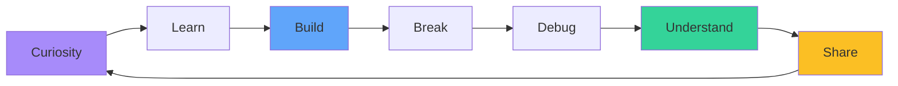

<div align="center">

# Hi there, I'm Anushka 👋


```ascii
╔══════════════════════════════════════════════════════════╗
║  🎓 2nd Year Computer Engineering Student                ║
║  💻 Code + 🎵 Music + 🌙 Late Night Builds              ║
║  🚀 Currently: Figuring things out, one commit at a time ║
╚══════════════════════════════════════════════════════════╝
```

[](https://www.linkedin.com/in/anushka-talole-j2007/)
[](https://github.com/AnushkaT-03)
[](mailto:anushkartalole@gmail.com)


</div>

---

## 🎯 What I'm Up To

> *Learning by doing...even if that means breaking things first (and then Googling how to fix them)*

I'm a **2nd year Computer Engineering student** navigating the exciting world of software development. My philosophy? Build, break, learn, repeat. Every bug is a lesson, and every project is an adventure.

### 🔥 Current Focus

<table>
<tr>
<td width="50%">

**📚 Deepening Knowledge**
- Mastering Java OOP concepts
- Understanding data structures & algorithms
- Building full-stack web applications
- Learning system design patterns

</td>
<td width="50%">

**🛠️ Active Projects**
- [Enginuity](https://github.com/AnushkaT-03/Enginuity) - Engineering tools platform
- [Smart-Connect](https://github.com/AnushkaT-03/smart-connect) - Connection platform
- Contributing to open-source projects
- Building my DSA problem-solving portfolio

</td>
</tr>
</table>

---

## 🛠️ Tech Stack & Tools

<div align="center">

### Languages


### Frameworks & Libraries


### Tools & Platforms


</div>

### 📊 My Skill Journey

```javascript
const anushka = {
  comfortable_with: ["Java", "C", "HTML/CSS", "Git", "Problem Solving"],
  currently_learning: ["JavaScript", "Python", "Tailwind CSS", "React", "DSA"],
  want_to_explore: ["Node.js", "MongoDB", "UI/UX Design", "System Design"],
  interests: ["Web Development", "UI/UX", "Open Source"],
  status: "perpetually_learning 📚",
  motto: "Build → Break → Learn → Repeat"
};
```

---

## 📈 GitHub Analytics

<div align="center">


</div>

<div align="center">

### 🔥 Contribution Streak


### 📊 Activity Graph


</div>

---

## 🚀 Featured Projects

<div align="center">

<table>
<tr>
<td width="50%">

### 🔧 [Enginuity](https://github.com/AnushkaT-03/Enginuity)
**For engineers, by an engineer-in-training**

Building a comprehensive platform to help engineering students with resources, tools, and collaboration.

`In Active Development`

</td>
<td width="50%">

### 🔗 [Smart-Connect](https://github.com/AnushkaT-03/smart-connect)
**Connecting dots, making things useful**

Experimental project exploring connection systems and network interactions.

`Prototype Phase`

</td>
</tr>
<tr>
<td width="50%">

### 📚 [DSA Journey](https://github.com/AnushkaT-03/DSA)
**My problem-solving evolution**

Documenting my data structures and algorithms learning journey, one problem at a time.

`Learning Log`

</td>
<td width="50%">

### 🧪 [Mini-Projects](https://github.com/AnushkaT-03/Mini-Projects)
**Tiny experiments, big learnings**

A collection of small projects where I test ideas, explore new technologies, and learn by doing.

`Experimental Playground`

</td>
</tr>
</table>

</div>

---

## 💡 My Learning Philosophy

<div align="center">



</div>

I'm not here to pretend I know everything. I'm here to:

- 🧠 **Learn** what I don't know (which is a lot!)
- 🔨 **Build** what sparks my curiosity
- 📢 **Share** what I figure out along the way
- 📈 **Improve** with every single commit
- 🤝 **Collaborate** and grow with the community

> *"The expert in anything was once a beginner who never gave up."*

---

## 🌱 Current Learning Goals

- [ ] Complete 100 DSA problems by end of semester
- [ ] Build and deploy 3 full-stack projects
- [ ] Contribute to 5 open-source projects
- [ ] Master React and build a production-ready app
- [ ] Create a comprehensive portfolio website
- [ ] Write technical blogs about my learning journey

---

## 📊 Weekly Development Breakdown

<!--START_SECTION:waka-->
```text
JavaScript   8 hrs 23 mins   ████████████░░░░░░░░░   48.2%
Java         4 hrs 15 mins   ██████░░░░░░░░░░░░░░░   24.5%
HTML/CSS     2 hrs 45 mins   ████░░░░░░░░░░░░░░░░░   15.8%
Python       1 hr 30 mins    ██░░░░░░░░░░░░░░░░░░░    8.7%
Other        30 mins         ░░░░░░░░░░░░░░░░░░░░░    2.8%
```
<!--END_SECTION:waka-->

---

## 🎨 When I'm Not Coding

- 🎵 Discovering new music (always open to recommendations!)
- 📖 Reading tech blogs and documentation
- 🎨 Exploring UI/UX design principles
- ☕ Trying to perfect the perfect cup of coffee
- 🌙 Late-night builds (because bugs never sleep)

---

## 📫 Let's Connect & Collaborate

<div align="center">

I'm always excited to connect with fellow learners, developers, and anyone passionate about technology!

**Feel free to reach out for:**
- Collaboration on projects
- Study groups or pair programming
- Tech discussions and knowledge sharing
- Feedback on my projects
- Or just a friendly chat about code!

<table>
<tr>
<td align="center" width="33%">

### 💼 Professional

[](https://www.linkedin.com/in/anushka-talole-j2007/)

*Let's grow our networks!*

</td>
<td align="center" width="33%">

### 💻 Code & Projects

[](https://github.com/AnushkaT-03)

*Check out my work!*

</td>
<td align="center" width="33%">

### 📧 Direct Contact

[](mailto:anushkartalole@gmail.com)

*Drop me a message!*

</td>
</tr>
</table>

</div>

---

## 🏆 GitHub Trophies

<div align="center">


</div>

---

<div align="center">

### ⚡ Fun Fact

```python
def describe_me():
    traits = {
        "coffee_dependency": "critical",
        "debug_skills": "improving",
        "enthusiasm": "overflowing",
        "bugs_created": "countless",
        "bugs_fixed": "almost as many",
        "learning_curve": "steep but exciting"
    }
    return traits

# Output: A developer in the making! 🚀
```

---

### 💭 Visitor's Message Board

*Leave a ⭐ if you found my profile interesting!*

**Thanks for stopping by!** 

*Pushing myself to be better than yesterday's version of me, one commit at a time.* 💪

---


</div>
